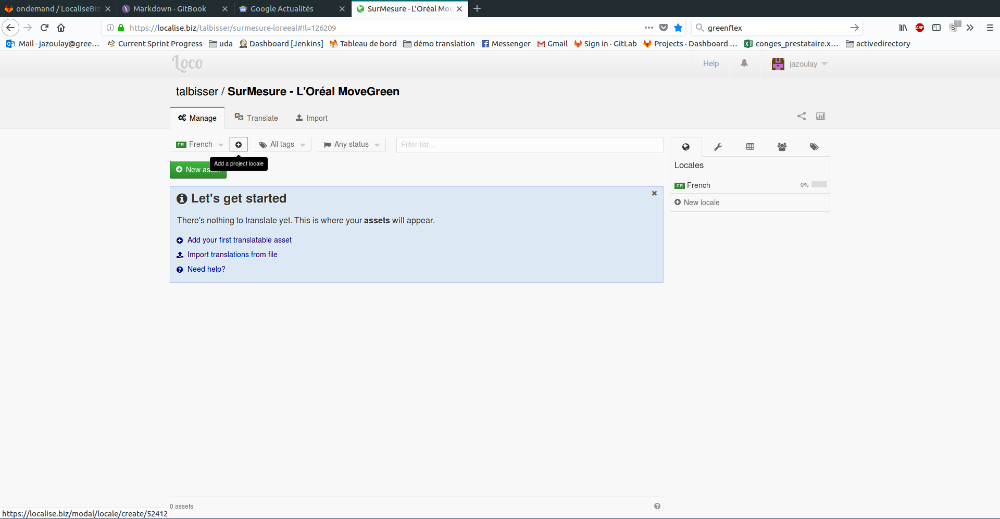
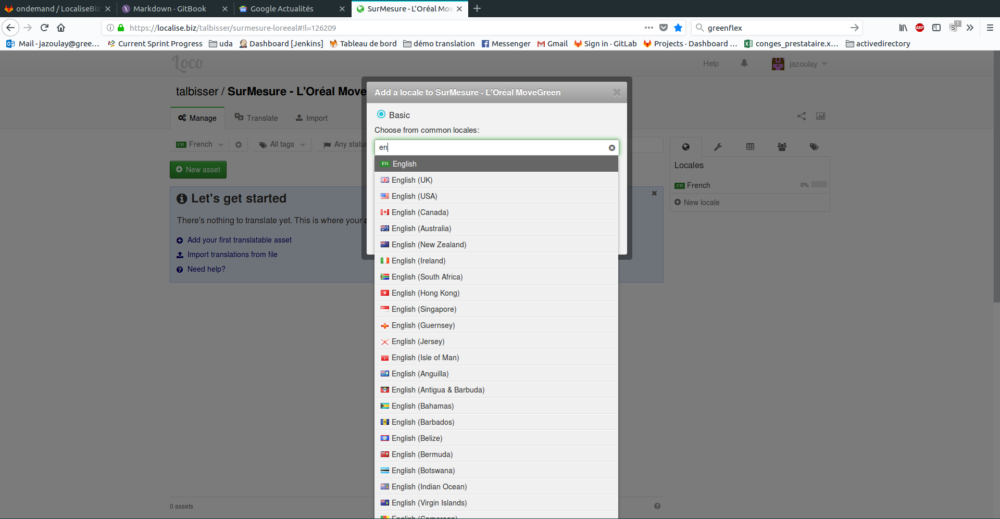
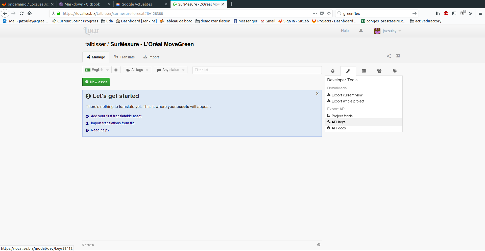
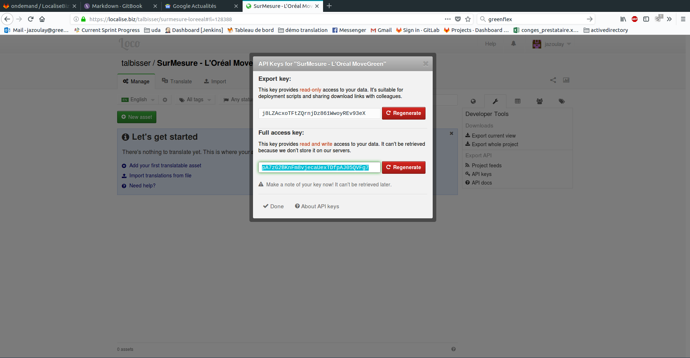

# LocaliseBizSync

_LocaliseBizSync est un logiciel qui permet de synchroniser des fichiers de traduction au format json avec le logiciel SaaS de traduction [localise.biz/](https://localise.biz/) codé en [NodeJs](https://nodejs.org/en/)_

## Pré-requis

_NodeJs sur le serveur en version minimum 8_

## Installation


```bash
npm -g install localizediff
```


## Logiciel

> Utiliser l'option `-v` afin d'afficher un maximum d'informations

```bash
$ localizediff -h

  Usage: localisebizsync [options] <cmd>

  Options:

    -V, --version                output the version number
    -v, --verbose                display verbose
    -f, --from [language]        language from extract
    -d, --direction [direction]  use 'down' if local changes should be overwritten [default: 'down'] ( use for sync cmd )
    -h, --help                   output usage information

  Infos:
	Write configuration in localize.yaml file. Open README.md

  Commandes:
	sync 	 synchronize translation with localise.biz
	extract  extract key from language for others
	download downlaod translations file from localise.biz to local pathToTranslations

  Usages:
	localizediff sync
	localizediff -v -d up sync
	localizediff -l en extract
	localizediff -v -f fr extract
	localizediff -v download
```

### Configuration

_La configuration du fichier se fait via un fichier nommé `localize.yaml` (voir le fichier localize.yaml.dist) à la racine du projet_

```yaml
params:
  localisebiz: https://localise.biz/api # link to api localise.biz
  languages: ["en", "fr"] # language do you want translate
  pathToTranslations: # path to local folder with all translation files (fr.json, en.json, es.json, ...)
  key: # key read and write localise.biz api
  filter: reactjs # tag 
  commandAfterSync: # command execute if files changed after synchronization (ex : "make --directory=/home/my-project yarn-install")
```

> Les fichiers de traduction doivent avoir comme nom le partern suivant : {code ISO 639-1}.json (fr.json, en.json, zh.json, ...) [Wikipedia](https://fr.wikipedia.org/wiki/Liste_des_codes_ISO_639-1)

# Localise.biz

## Initialiser mon projet

1. Il faut choisir les langues dont le projet sera traduit.

> Choisir les extensions de langue plutot que les pays par exemple pour l'anglais choisir `en`




2. Générer une clé API read/write




# Cas utilisations

**1. Initialiser un projet**

- _J'ai_

  J'ai un projet existant avec un fichier de traduction dans une langue (exemple Français)

- _Je veux_

  Je veux que le projet sois traduisible en plusieurs langages (exemple Français / Anglais) sur localise.biz

_Étape n°1 : Mon fichier de configuration_

localize.yaml

```yaml
params:
  localisebiz: https://localise.biz/api
  languages: ["fr", "en"]
  pathToTranslations: /path/to/translations
  key: pn1sRbXIzpnDokQ7NxukHSXCAsRgY99Gw
  filter: reactjs
```

_Étape n°2 : Extraction du fichier de traduction français pour la traduction anglaise_

```bash
$ localizediff -v -l fr extract
```

_Étape n°3: Synchroniser les traductions du projet en local vers localise.biz_

```bash
$ localizediff -v -d up sync
```

**2. Le projet est sur un serveur recette, ux ou prod**

- _J'ai_

  Le projet est installé sur un serveur de prod

- _Je veux_

  Je veux que la traduction se met automatiquement à jours si un product owner change du texte

_Étape n°1 : Mon fichier de configuration_

localize.yaml

```yaml
params:
  localisebiz: https://localise.biz/api
  languages: ["fr", "en"]
  pathToTranslations: /path/to/translations
  key: pn1sRbXIzpnDokQ7NxukHSXCAsRgY99Gw
  filter: reactjs
  commandAfterSync: "make --directory=/path/to/Makefile yarn-build" # example make execute `yarn build`
```

_Étape n°2 : Création d'un cron toutes les 30 minutes_

`*/30 * * * * node /path/to/LocaliseBizSync/localizediff sync >/dev/null 2>&1`

**3. Mettre à jours localise.biz**

- _J'ai_

  J'ai fait une modification en local

- _Je veux_

  Je veux mettre à jours ma version sur localise.biz

_Étape n°1 : Synchroniser les traductions du local vers localise.biz_

```bash
$ localizediff -v -d up sync
```

**4. Mettre à jours mon environement de développement**

- _J'ai_

  Le Product Owner a mis à jours la traduction sur localise.biz

- _Je veux_

  Je veux mettre à jours mon environnement de développement

_Étape n°1 : Synchroniser les traductions de localise.biz vers mon locale_

```bash
$ localizediff -v sync
```

**5. Je ne veux pas que mes fichiers de traduction soient sur mon logiciel de gestion de versions Git**

- _J'ai_

  Mes traductions sont sur localise.biz et seulement sur localise.biz

- _Je veux_

  Je veux pouvoir coder avec mes fichiers de traduction en local dans un projet react

_Étape n°1 : Ignorer les fichiers de traduction sur git_

Editer le fichier _.gitignore_

```
/path/to/folder/translation
```

_Étape n°2 : Télécharger les traductions de localise.biz vers mon locale_

```bash
$ localizediff -v download
```
